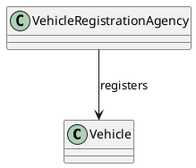
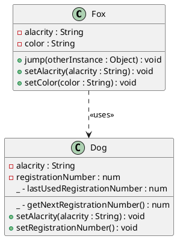
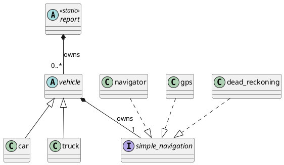

# Communicating Design Through UML 🌐

We are leaving the terrain of basic object-oriented principles and entering the galaxy of **Design Patterns**.  
To navigate this vast expanse, we need **celestial mapping and cosmic diagramming** — this is where **Unified Modeling Language (UML)** comes in.

---

## 🌟 What is UML?

- **Unified Modeling Language (UML)** was created in **1996** by:
  - **James Rumbaugh**
  - **Grady Booch**
  - **Ivar Jacobson**  
  *(a.k.a. The Three Amigos)*  
- They consolidated:
  - **OMT** (Object Modeling Technique)
  - **OOD** (Object-Oriented Design)  
- Adopted in **1997** by the **Object Modeling Group (OMG)** as a **non-proprietary standard** for software engineering.

---

## 📜 Current UML Standard
- **Version:** 2.5 (June 2015)
- Defines **14 types of diagrams**, divided into:
  - **Structural diagrams** (class, component, deployment, etc.)
  - **Behavioral diagrams** (sequence, activity, state machine, etc.)

---

## ✅ Focus for Our Journey
A full UML explanation is beyond scope, so we’ll focus on the **Class Diagram**, which:
- Organizes and depicts **classes and interfaces**
- Shows **attributes, behaviors**
- Illustrates **relationships** between entities

---

## 🧩 Why UML?
- **Visual communication** of design
- Bridges gap between **conceptual design** and **implementation**
- Helps teams **collaborate effectively**

---

## 🌌 Key Takeaways
- UML is our **navigation tool** for exploring advanced design patterns.
- **Class diagrams** will be our primary map for depicting OO structures.
- This is the **flight training** before we reach the stars of **Design Patterns**.

---

### UML Diagram Types (Hierarchy)
- **Structural**
  - Class Diagram
  - Component Diagram
  - Deployment Diagram
  - Object Diagram
  - Package Diagram
- **Behavioral**
  - Sequence Diagram
  - Activity Diagram
  - State Machine Diagram
  - Use Case Diagram
  - Communication Diagram

---

> **From Objectropolis to the Galaxy of Design Patterns — UML is our star map.**

# UML Class Diagrams 📦

A **UML Class Diagram** represents classes and interfaces using **boxes divided into three sections**:

1. **Top Section**: Class or interface name (centered)
2. **Middle Section**: Attributes
3. **Bottom Section**: Behaviors (methods)

Boxes are connected by **relationship lines** to show associations.

---

## ✅ Box Structure

- **Class Name**: Centered in the top section
- **Interface Name**: Preceded by `<<interface>>`
- **Attributes**:
  - Left-justified
  - Format: `visibility name : type = defaultValue`
- **Behaviors**:
  - Left-justified
  - Format: `visibility methodName(paramName : type) : returnType`
  - `void` indicates no return value
- **Abstract entries**: *Italicized*
- **Camel Case**: Use **lowerCamelCase** for names

---

### Visibility Indicators
- `+` Public  
- `-` Private  
- `#` Protected  
- `~` Package  
- `/` Derived (can combine with others)  
- `_` Static (combine with others)  

---

## 🔗 Relationships Between Classes
Three categories:
1. **Class-Level Relationships**
   - **Generalization**: Solid line + unfilled triangular arrowhead → parent class  
     *(represents “is-a” relationship, inheritance)*
   - **Realization**: Dashed line + unfilled triangular arrowhead → interface  
     *(represents “implements” relationship)*
2. **Instance-Level Relationships**
   - Associations, aggregations, compositions
3. **General Relationships**
   - Dependencies, navigability, etc.

---

## 🖼 Example: Car Class & simpleNavigation Interface

# UML Instance-Level Relationships 🔗

Instance-level relationships (links) depict how **objects** relate to one another.  
There are **three main types**, each stronger than the previous:

---

## ✅ Types of Instance-Level Relationships

### 1. **Association** — “relates to”
- Represents a general connection between two entities.
- **Variations**:
  - **Unidirectional**: One entity knows about the other.  
    Example: `vehicleRegistrationAgency → vehicle`
    - Represented by a **solid line with an arrowhead** pointing to the entity that does **NOT** know the other.
  - **Bidirectional**: Both entities know each other.  
    Example: `patient ↔ physician`
    - Represented by a **solid line** (no arrowhead).
  - **Reflexive**: A class relates to itself.  
    Example: `employee ↔ manager` (both are employees)
    - Represented by a **solid line looping back to the same class box**.

---

### 2. **Aggregation** — “has a”
- Represents a **whole-part** relationship where the whole **contains** parts.
- **Independent lifecycle**: When the whole is destroyed, parts **remain alive**.
- Example: `Pond has Ducks` → Ducks fly away if pond is drained.
- **Notation**: Solid line with **unfilled diamond** at the end pointing to the **aggregator**.

---

### 3. **Composition** — “owns a”
- Represents a **strong whole-part** relationship.
- **Dependent lifecycle**: When the whole is destroyed, parts are **destroyed too**.
- Example: `Car owns Carburetor` → Destroy car → carburetor destroyed.
- **Notation**: Solid line with **filled diamond** at the end pointing to the **composer**.

---

## 🔍 Aggregation vs Composition
| Aspect        | Aggregation (“has a”) | Composition (“owns a”) |
|--------------|------------------------|-------------------------|
| Lifecycle    | Independent           | Dependent              |
| Example      | Pond → Duck           | Car → Carburetor       |
| UML Symbol   | ◇ (unfilled diamond)  | ◆ (filled diamond)     |

---

## 🔢 Cardinality (Multiplicity)
Indicates **how many instances** can participate in the relationship:
- `0..1` → Zero or one
- `1` → Exactly one
- `0..*` → Zero or more
- `1..*` → One or more
- Explicit ranges: `0..4`, `5`, `5..9`, `6..*`

**Examples**:
- Car → Engine: `1` to `1` (composition)
- Car → Supercharger: `1` to `0..1` (optional composition)
- ParkingLot → Car: `1` to `0..*` (aggregation)

---

## 🖼 UML PlantUML Examples

### Association (Unidirectional)

# UML General Relationships 🔗

A **general relationship** in UML is called a **Dependency**.  
It represents a connection where **one entity depends on another entity (the supplier)** for its implementation.

---

## ✅ Dependency Relationship
- **Meaning**: “depends on”
- **Examples of dependency types**:
  - `<<uses>>`
  - `<<calls>>`
  - `<<instantiates>>`
- **Notation**:
  - **Dashed line** with an **open arrowhead** pointing to the **supplier**
  - Dependency type is shown in **guillemets** (`<< >>`) next to the line

---

### UML Representation

# UML Class Diagram Example: Fox & Dog 🦊🐶

This example demonstrates how to represent classes, attributes, behaviors, and relationships using **UML Class Diagrams**.

---

## ✅ Description of Classes

### **Fox Class**
- **Attributes**:
  - `- alacrity : String`
  - `- color : String`
- **Behaviors**:
  - `+ jump(otherInstance : Object) : void`
  - `+ setAlacrity(alacrity : String) : void`
  - `+ setColor(color : String) : void`

---

### **Dog Class**
- **Attributes**:
  - `- alacrity : String`
  - `- registrationNumber : num`
  - `_ - lastUsedRegistrationNumber : num` *(static private)*
- **Behaviors**:
  - `_ - getNextRegistrationNumber() : num` *(static private)*
  - `+ setAlacrity(alacrity : String) : void`
  - `+ setRegistrationNumber() : void`

---

## 🔗 Relationship
- **General Relationship (Dependency)**:
  - **Fox depends on Dog** (`<<uses>>`)
  - Fox needs a Dog instance to perform `jump()`
  - Represented by a **dashed line with open arrowhead** pointing to **Dog**

---

## 🖼 UML Diagram (PlantUML)

# UML Class Diagram Example: Report, Vehicle & Navigation System 🚗🛰️

This UML diagram illustrates **abstract classes**, **interfaces**, **concrete classes**, and their relationships.

---

## ✅ Class Definitions
1. **report**  
   - **Static Abstract Class** → Name in *italic*  
   - Owns instances of `vehicle` classes  
2. **vehicle**  
   - **Abstract Class** → Name in *italic*  
   - Parent of `car` and `truck`  
   - Owns instances of classes implementing `simple_navigation`  
3. **car**  
   - **Concrete Class** → Name in regular font  
   - Inherits from `vehicle`  
4. **truck**  
   - **Concrete Class** → Name in regular font  
   - Inherits from `vehicle`  
5. **<<interface>> simple_navigation**  
   - Interface → Name in *italic* with `<<interface>>` banner  
   - Defines abstract methods for navigation  
6. **navigator**  
   - Concrete class implementing `simple_navigation`  
7. **gps**  
   - Concrete class implementing `simple_navigation`  
8. **dead_reckoning**  
   - Concrete class implementing `simple_navigation`  

---

## 🔗 Relationships
- **Implements (Realization)**:  
  - `navigator`, `gps`, `dead_reckoning` → `simple_navigation`  
  - Represented by **dashed line with unfilled triangular arrowhead** pointing to interface  
- **Inheritance (Generalization)**:  
  - `car`, `truck` → `vehicle`  
  - Represented by **solid line with unfilled triangular arrowhead** pointing to parent  
- **Composition (“owns a”)**:  
  - `report` → `vehicle`  
    - Cardinality: `report (1)` → `vehicle (0..*)`  
  - `vehicle` → `simple_navigation`  
    - Cardinality: `vehicle (1)` → `simple_navigation (1)`  
  - Represented by **solid line with filled diamond arrowhead** pointing to owning class  

---

## 🔢 Cardinality
- `report` → `vehicle`: `1` to `0..*`  
- `vehicle` → `simple_navigation`: `1` to `1`  

---

## 🖼 UML Diagram (PlantUML)

# UML Summary ✅

In this chapter, we explored the **Unified Modeling Language (UML)** and its role in communicating design.

---

## 🧠 Key Learnings

### 1. **Origins of UML**
- Created in **1996** by **James Rumbaugh**, **Grady Booch**, and **Ivar Jacobson** (The Three Amigos).
- Unified **OMT** (Object Modeling Technique) and **OOD** (Object-Oriented Design).
- Adopted in **1997** by the **Object Modeling Group (OMG)**.

---

### 2. **Class Diagram Basics**
- Represents a **class** as a **box with three sections**:
  - **Top**: Class name (italic for abstract, `<<interface>>` for interfaces)
  - **Middle**: Attributes
  - **Bottom**: Behaviors (methods)
- **Notation**:
  - Lower **camelCase** for names
  - Visibility indicators:
    - `+` Public
    - `-` Private
    - `#` Protected
    - `~` Package
    - `_` Static
    - `/` Derived
- Abstract entries → *italic font*

---

### 3. **Relationship Categories**
- **Class-Level Relationships**:
  - **Generalization** (`is-a`): Solid line + unfilled triangle → inheritance
  - **Realization** (`implements`): Dashed line + unfilled triangle → interface implementation
- **Instance-Level Relationships**:
  - **Association** (`relates to`): Solid line (uni/bidirectional/reflexive)
  - **Aggregation** (`has a`): Solid line + unfilled diamond → independent lifecycle
  - **Composition** (`owns a`): Solid line + filled diamond → dependent lifecycle
  - **Cardinality**: `1`, `0..*`, `1..*`, or explicit ranges (`0..4`, `5..9`)
- **General Relationships**:
  - **Dependency** (`depends on`): Dashed line + open arrowhead → supplier
  - Annotated with `<<uses>>`, `<<calls>>`, `<<instantiates>>`

---

## ✅ Why UML Matters
- Provides a **visual language** for object-oriented design.
- Bridges the gap between **conceptual design** and **implementation**.
- Essential for **design patterns**, **architecture**, and **team collaboration**.

---

> UML is the **blueprint** for object-oriented systems, enabling clear communication of structure and behavior.
